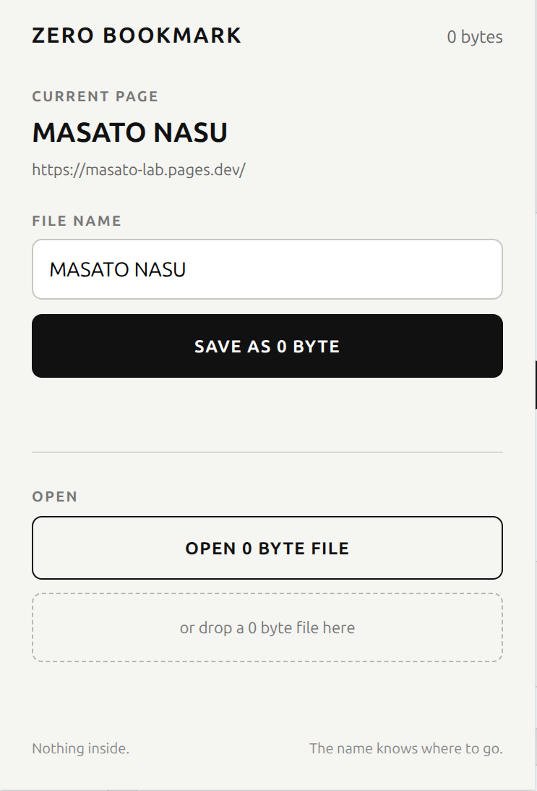

# ZERO BOOKMARK

**Save a web page as a real 0-byte file.**

ZERO BOOKMARK is a Chrome extension that turns the current web page into an empty file you can keep on your desktop, organize in folders, copy, and share.

The file contains **0 bytes**. The web page itself is not stored inside it. Instead, the URL is encoded in the filename after `__0B__`.

> The file contains nothing. It still knows where to go.

## How it works

1. Open any `http://` or `https://` page.
2. Click the ZERO BOOKMARK extension.
3. Give the bookmark any visible name you like.
4. Click **SAVE AS 0 BYTE**.
5. A real 0-byte file is downloaded.
6. Later, open ZERO BOOKMARK and select or drop that file.
7. The original web page opens.

The visible part of the filename, before `__0B__`, can be renamed freely. The encoded section after `__0B__` must remain intact.

## Share it

A ZERO BOOKMARK file can be copied to another computer and opened by another ZERO BOOKMARK installation, as long as the filename is preserved.

Some email, chat, or cloud services may reject empty files or rename them. Direct filesystem copy, USB transfer, ZIP archives, or other methods that preserve the filename are more reliable.

## Privacy

- No account
- No server-side URL database
- No browsing-history permission
- No storage permission
- No analytics or external libraries
- Only `activeTab` permission is requested, so the current page is accessed when you invoke the extension

## Important

ZERO BOOKMARK does **not** compress an entire web page to zero bytes. The page content remains on the web. Only the address needed to return to it is encoded in the filename.

Very long URLs can exceed practical filesystem filename limits and are rejected.

## Install in Chrome

1. Download and unzip the release.
2. Open `chrome://extensions`.
3. Turn on **Developer mode**.
4. Click **Load unpacked**.
5. Select the `ZERO-BOOKMARK-v0.2.0-CHROME` folder.
6. Pin ZERO BOOKMARK to the toolbar if desired.

## Version

v0.2.0
